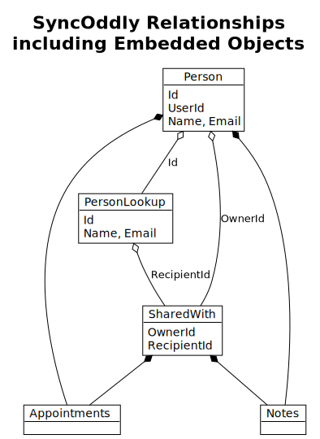

# SyncOddly Realm Subscriptions
Documents the subscriptions to make it easy to ensure we have the right fields enabled for functional roles.

The idea is to have a clean database structure that maps to the MongoDB document nesting philosophy 
with few, simple subscriptions active for a given user. Even if someone is engaged in dozens of sharing relationships, this copes.

## Named Subscriptions

The users we have as per the following table:
- All - assume anyone with a sync account
- Owner - current logged in user, "owner" of personal data
- Sharee - person or possibly group with whom things are shared

| Name            | User   | Realm Obj    | Filter on   | Notes                                   |
|-----------------|--------|--------------|-------------|-----------------------------------------|
| Lookups         | All    | PersonLookup | n/a         | Needed to get Id to share with someone  |
| Mine            | Owner  | Person       | UserId      | Source of truth, inc nested Notes/Appts |
| Sharing         | Owner  | SharedWith   | OwnerId     | Everything I share with others          |
| InShared        | Sharee | SharedWith   | RecipientId | **All** stuff shared with me in one hit |
| PeopleSamples   | Owner  | Person       | Created     | Temp subs whilst creating sample data   |
| SharingSamples  | Owner  | SharedWith   | Created     | Temp subs whilst creating sample data   |


Note that `Person.UserId` is a GUID of an authorised user. It's not the same value as `Person.Id` which is copied to `PersonLookup.Id` and used as `SharedWith` `RecipientId` and `OwnerId`.

### Sample Data Sync
The term _Sample_ is used because the primary case is for generating samples but it also applies when pushing up data for other users than the current user.

The surprising gotcha in using Flexible Sync is that your data writes must **conform to an active subscription** otherwise the data is written locally then deleted by sync.

Our subscriptions are optimised for fast and minimal data exchange for normal circumstances.

It would be possible to push sample data up simply by subscribing to **All** the data in each collection, but that implies that other data will be downloaded.

Using a single exact timestamp for these special _push subscriptions_ means the chance of downloading other data is minimal.


## Diagramming relationships

The diagram below shows the relationships of the normal subs. The _aggregations_ (solid diamonds) indicate those types (`Appointments` and `Notes`) are actually stored as `EmbeddedObjects` within their owning `Person` and `SharedWith` so don't need a separate subscription - they are pulled down as part of the parent object.



```
@startuml
!theme plain

title SyncOddly Relationships\nincluding Embedded Objects

object Person
object PersonLookup
object SharedWith
object Appointments
object Notes

Person o-- PersonLookup : Id
Person o-- SharedWith : OwnerId
Person *-- Appointments
Person *-- Notes

PersonLookup o-- SharedWith : RecipientId

SharedWith *-- Appointments
SharedWith *-- Notes

Person : Id
Person : UserId
Person : Name, Email
PersonLookup : Id
PersonLookup : Name, Email
SharedWith : OwnerId
SharedWith : RecipientId


@enduml
```