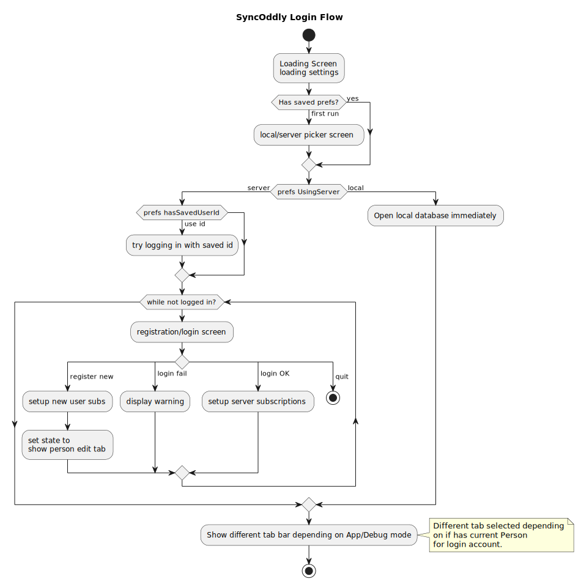

# SyncOddly LoginFlow

Login handles having a local database option as well as using server-based credentials.

## Testing Scenarios

### Local Database
- App not installed = First run
  - picker for local/server appears - pick local
  - tabs appear with empty data
  

### Server 
- App not installed = First run - new user
  - picker for local/server appears - pick server
  - register user
  - forced to enter other user details after register
  - tabs appear with current user as sole Person  

- App not installed = First run - existing user
  - picker for local/server appears - pick server
  - login to existing account
  - see other scenarios below
  
- Have logged in but Not finished current user
  - forced to enter other user details after register
  - tabs appear with current user as sole Person  

- Have logged in OK before
  - tabs appear with current user as sole Person  

## The Password Problem
There's a bizarre bug in Xamarin Forms experience, as described in [this SO question][SO1], where the Apple _Strong Password_ suggestion overlay appears without any way to cancel it so you can type in your own password. See also [this suggested solution][SO2]. 

## Diagram source
@startuml

title SyncOddly Login Flow 

start

:Loading Screen\nloading settings; 

if (Has saved prefs?) then (yes)
else (first run)
  :local/server picker screen;
endif

if (prefs UsingServer) then (server)
   if (prefs hasSavedUserId) then (use id)
      :try logging in with saved id;
   end if
   while (while not logged in?)
       :registration/login screen;
       switch ()
       case ( register new)
           :setup new user subs;
           :set state to\nshow person edit tab;
       case ( login fail)
           :display warning;
       case ( login OK)
            :setup server subscriptions;
       case ( quit)
           stop
       endswitch
   endwhile
 else (local)
		 :Open local database immediately;
 endif
:Show different tab bar depending on App/Debug mode;
note right 
Different tab selected depending 
on if has current Person
for login account.
end note
stop

@enduml

[SO1]: https://stackoverflow.com/questions/63486793/xamarin-forms-disable-auto-create-strong-password-on-login-page
[SO2]: https://stackoverflow.com/questions/58208781/how-can-i-implement-hide-show-password-style-experience-for-ios-with-uitextview