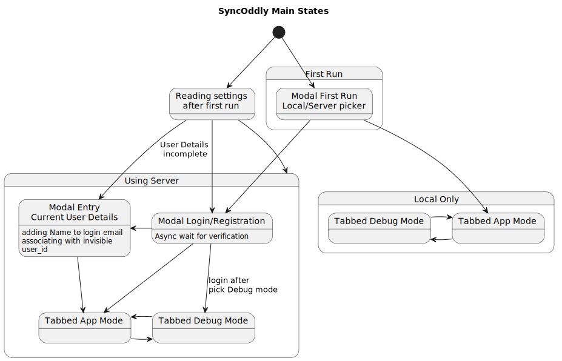

# SyncOddly Main States

Main app states including server login and registration. See also `LoginFlow.md`

@startuml

title SyncOddly Main States

state "First Run" as FR {
  state "Modal First Run\nLocal/Server picker" as FRP
}

state "Using Server" as Srv {
  state "Modal Login/Registration" as LReg : Async wait for verification
  state "Tabbed App Mode" as TAMsrv
  state "Tabbed Debug Mode" as TDMsrv
  state "Modal Entry\nCurrent User Details" as MUE : adding Name to login email\nassociating with invisible\nuser_id
  LReg -> TAMsrv
  LReg -> TDMsrv : login after \lpick Debug mode
  LReg -> MUE
  TAMsrv -> TDMsrv
  TDMsrv -> TAMsrv
}

state "Local Only" as Loc {
  state "Tabbed App Mode" as TAMloc
  state "Tabbed Debug Mode" as TDMloc
  TAMloc -> TDMloc
  TDMloc -> TAMloc
}

state "Reading settings\nafter first run" as Sett
Sett --> LReg
Sett --> Srv
Sett --> MUE : User Details\n incomplete
MUE -d-> TAMsrv

[*] --> FRP
[*] --> Sett

FRP -d-> TAMloc
FRP -d-> LReg

@enduml